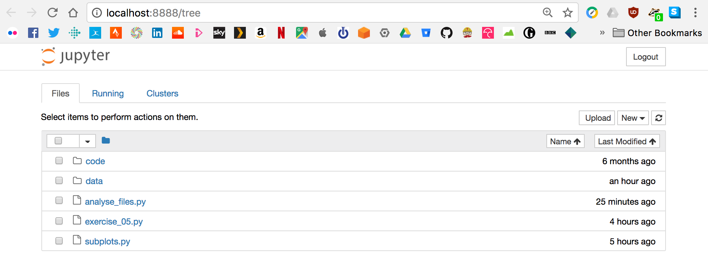

```{r setup, include=FALSE}
knitr::opts_chunk$set(echo = TRUE)
```

## Etherpad

Please do use the course Etherpad:

- [http://pad.software-carpentry.org/2018-11-27-standrews](http://pad.software-carpentry.org/2018-11-27-standrews)

<div class="highlight">
- **Communal notes**: share your understanding, and benefit from others
- **Ask questions**: get detailed answers with links and examples
- **A record/reference for after the course**
</div>


## Why Are We Here?

- **To learn basic concepts of programming** (in Python)

<div class="attention">
- **How to solve problems in your research by…**
  - Building scripts
  - Automating tasks
</div>
  
<div class="highlight">
- **Mechanics of manipulating data**
  - File I/O
  - Data structures
</div>


## XKCD

<center>

</center>

## How Are We Doing This?

<div class="highlight">
**Using the `Python` language**
</div>

- we need *something* ;)
- free, well-documented, and cross-platform
- large academic userbase
- many *libraries* for specialist work


<div class="attention">
**we won't be covering the entire language**
</div>


## No, I mean "*how* are we doing this?"

<div class="attention">
**Text editor**

- the more usual way to write code
- edit-save-execute cycle
</div>

<div class="highlight">
**`Jupyter` notebook**

- interactive notebook-based interface
- good for data exploration, prototyping, and teaching
- not so good for writing scripts/'production code'
</div>


## Do I need to use `Python` afterwards?

- No. ;)
  - The lesson is general, it's just taught in `Python`
  - The principles are the same in nearly all languages
  - If your colleagues/field settled on another language(s), maybe learn that
  - (language wars are unproductive… ;) )


## What are we doing?

<div class="highlight">
**Analysing and visualising experimental data**

- Effectiveness of a new treatment for arthritis
- Several patients, recording inflammation on each day
- Tabular (comma-separated) data
</div>

<div class="attention">
**We're going to get the computer to do this for us**

- Why not just do it by hand?
- **AUTOMATION**, **REUSE**, **SHARING**
</div>


# 01. Setup

## Setting Up - 1

Before we begin… 

- **make a neat working environment in the terminal**
- obtain data

```bash
cd ~/Desktop
mkdir python-novice-inflammation
cd python-novice-inflammation
```

<div class="attention">
**LIVE DEMO**
</div>


## Setting up - 2

Before we begin… 

* make a neat working environment
* **obtain data**

```bash
cp 2018-03-29-standrews/lessons/python/files/python-novice-inflammation-data.zip ./
unzip python-novice-inflammation-data.zip
cp 2018-03-29-standrews/lessons/python/files/python-novice-inflammation-code.zip ./
unzip python-novice-inflammation-code.zip
```

(you can download files via [`Etherpad`](http://pad.software-carpentry.org/2018-11-27-standrews): [http://pad.software-carpentry.org/2018-11-27-standrews](http://pad.software-carpentry.org/2018-11-27-standrews))

<div class="attention">
**LIVE DEMO**
</div>

<center>

</center>


# 02. Getting Started

## `Python` in the terminal

<div class="highlight">
We start the `Python` console by executing the command `python`
</div>

```bash
$ python
Python 3.6.3 |Anaconda custom (64-bit)| (default, Oct  6 2017, 12:04:38) 
[GCC 4.2.1 Compatible Clang 4.0.1 (tags/RELEASE_401/final)] on darwin
Type "help", "copyright", "credits" or "license" for more information.
>>> 
```

<div class="attention">
**LIVE DEMO**
</div>

<center>

</center>


## `Python` REPL

- `Python`'s **console** is a *read-evaluate-print-loop*, just like the shell

```python
>>> 3 + 5
8
>>> 12 / 7
1.7142857142857142
>>> 2 ** 16
65536
>>> 15 % 4
3
>>> (2 + 4) * (3 - 7)
-24
```

<div class="attention">
**LIVE DEMO**
</div>

<center>

</center>


## My first variable

- To do interesting things, we want *persistent* values

<div class="highlight">
- variables are like *named boxes*
- data goes in the box
- when we use the name of the box, we mean **what's in the box**
</div>

<center>

</center>

## Creating a variable

<div class="attention">
- To *assign* a value use the *equals sign*: `=`
- The variable name/box label goes on the left, and the data item goes on the right
- *Character strings*, or just *strings*, are enclosed in quotes
</div>

```python
>>> name = "Samia"
>>> name
'Samia'
>>> print(name)
Samia
```

<div class="attention">
**LIVE DEMO**
</div>

<center>

</center>


## Working with variables

```python
weight_kg = 55
print(weight_kg)
2.2 * weight_kg
print("weight in pounds", 2.2 * weight_kg)
weight_kg = 57.5
print("weight in kilograms is now:", weight_kg)
weight_lb = 2.2 * weight_kg
print('weight in kilograms:', weight_kg, 'and in pounds:', weight_lb)
weight_kg = 100
print('weight in kilograms:', weight_kg, 'and in pounds:', weight_lb)
```

<div class="attention">
**LIVE DEMO**
</div>

<center>

</center>


##  Exercise 01 (5min)

<div class="highlight">
What are the values in `mass` and `age` after the following code is executed?
</div>

```python
mass = 47.5
age = 122
mass = mass * 2.0
age = age - 20
```

1. `mass == 47.5`, `age == 122`
2. `mass == 95.0`, `age == 102`
3. `mass == 47.5`, `age == 102`
4. `mass == 95.0`, `age == 122`


##  Exercise 02 (5min)

<div class="highlight">
What does the following code print out?
</div>

```python
first, second = 'Grace', 'Hopper'
third, fourth = second, first
print(third, fourth)
```

1. `Hopper Grace`
2. `Grace Hopper`
3. `"Grace Hopper"`
4. `"Hopper Grace"`


# 03. Data Analysis

## Examine the data

- Inspect a data file using the shell

```bash
$ head data/inflammation-01.csv 
0,0,1,3,1,2,4,7,8,3,3,3,10,5,7,4,7,7,12,18,6,13,11,11,7,7,4,6,8,8,4,4,5,7,3,4,2,3,0,0
0,1,2,1,2,1,3,2,2,6,10,11,5,9,4,4,7,16,8,6,18,4,12,5,12,7,11,5,11,3,3,5,4,4,5,5,1,1,0,1
0,1,1,3,3,2,6,2,5,9,5,7,4,5,4,15,5,11,9,10,19,14,12,17,7,12,11,7,4,2,10,5,4,2,2,3,2,2,1,1
0,0,2,0,4,2,2,1,6,7,10,7,9,13,8,8,15,10,10,7,17,4,4,7,6,15,6,4,9,11,3,5,6,3,3,4,2,3,2,1
0,1,1,3,3,1,3,5,2,4,4,7,6,5,3,10,8,10,6,17,9,14,9,7,13,9,12,6,7,7,9,6,3,2,2,4,2,0,1,1
0,0,1,2,2,4,2,1,6,4,7,6,6,9,9,15,4,16,18,12,12,5,18,9,5,3,10,3,12,7,8,4,7,3,5,4,4,3,2,1
0,0,2,2,4,2,2,5,5,8,6,5,11,9,4,13,5,12,10,6,9,17,15,8,9,3,13,7,8,2,8,8,4,2,3,5,4,1,1,1
0,0,1,2,3,1,2,3,5,3,7,8,8,5,10,9,15,11,18,19,20,8,5,13,15,10,6,10,6,7,4,9,3,5,2,5,3,2,2,1
0,0,0,3,1,5,6,5,5,8,2,4,11,12,10,11,9,10,17,11,6,16,12,6,8,14,6,13,10,11,4,6,4,7,6,3,2,1,0,0
0,1,1,2,1,3,5,3,5,8,6,8,12,5,13,6,13,8,16,8,18,15,16,14,12,7,3,8,9,11,2,5,4,5,1,4,1,2,0,0
```

<div class="highlight">
- To load this data in `Python`, we'll use the `numpy` *library*
</div>

<div class="attention">
**We want to produce summary information about inflammation by patient and by day**
</div>


## `Python` libraries

- `Python` contains many powerful, general tools
- Specialised tools are contained in *libraries* or *packages*
- We call on libraries/packages, when needed
- Packages are loaded with `import`
- Packages are shared via repositories, e.g. [`PyPI`](https://pypi.python.org/pypi) and [`conda`](https://conda.io/docs/)

```python
>>> import numpy
```

<div class="attention">
**LIVE DEMO**
</div>

<center>

</center>


## Load data from file

- `numpy` provides a function `loadtxt()` to load tabular data:

```python
numpy.loadtxt(fname='data/inflammation-01.csv', delimiter=',')
```

<div class="highlight">
- *dotted notation* tells us `loadtxt()` belongs to `numpy`
- `fname`: an *argument* expecting the path to a file
- `delimiter`: an *argument* expecting the character that separates columns
</div>


## Loaded data

```python
>>> numpy.loadtxt(fname='data/inflammation-01.csv', delimiter=',')
array([[ 0.,  0.,  1., ...,  3.,  0.,  0.],
       [ 0.,  1.,  2., ...,  1.,  0.,  1.],
       [ 0.,  1.,  1., ...,  2.,  1.,  1.],
       ..., 
       [ 0.,  1.,  1., ...,  1.,  1.,  1.],
       [ 0.,  0.,  0., ...,  0.,  2.,  0.],
       [ 0.,  0.,  1., ...,  1.,  1.,  0.]])
```

- The matrix is truncated to fit the screen
- `...` indicate missing rows or columns
- If there are no significant digits, they are not shown (`1 == 1. == 1.0`)

<div class="highlight">
**Assign the matrix to a variable called `data`**
</div>

<div class="attention">
**LIVE DEMO**
</div>


## What is our data?

```python
>>> type(data)
<class 'numpy.ndarray'>
```

<div class="attention">
**LIVE DEMO**
</div>

<center>

</center>


## Members and attributes

- Creating the array created information, too
- Info stored in *members* or *attributes* that belong to `data`
- `data.<attribute>` e.g. `data.shape`

```python
>>> print(data.dtype)
float64
>>> print(data.shape)
(60, 40)
```

<div class="attention">
**LIVE DEMO**
</div>

<center>

</center>


## Indexing arrays

- We often work with subsets of data
  - individual rows (patients)
  - individual columns (days)

<div class="attention">
- Counting of array elements **starts at zero**, not at one.
</div>

```python
>>> print('first value in data:', data[0, 0])
first value in data: 0.0
>>> print('middle value in data:', data[30, 20])
middle value in data: 13.0
```

<center>

</center>

<div class="attention">
**LIVE DEMO**
</div>


## Slicing arrays

- To get a *range* of data from the array, index with `[` and specify *start* and *end* indices

<div class="attention">
- `0:4` means **start at zero** and go up to **but not including** 4
  - `0, 1, 2, 3`
</div>

<div class="highlight">
- Define *start* and *end* separated by `:` (colon).
</div>

```python
>>> print(data[0:4, 0:10])
[[ 0.  0.  1.  3.  1.  2.  4.  7.  8.  3.]
 [ 0.  1.  2.  1.  2.  1.  3.  2.  2.  6.]
 [ 0.  1.  1.  3.  3.  2.  6.  2.  5.  9.]
 [ 0.  0.  2.  0.  4.  2.  2.  1.  6.  7.]]
```

<div class="attention">
**LIVE DEMO**
</div>

<center>

</center>


## More slices, please!

<div class="highlight">
- Don't specify *start*, `Python` assumes the first element
- Don't specify *end*, `Python` assumes the end element
</div>

```python
>>> small = data[:3, 36:]
>>> print('small is:\n', small)
```

<div class="attention">
**QUESTION:** What would `:` on its own indicate?
</div>

<div class="attention">
**LIVE DEMO**
</div>

<center>

</center>


##  Exercise 03 (5min)

We can take slices of any series, not just arrays.

```python
>>> element = 'oxygen'
>>> print('first three characters:', element[0:3])
first three characters: oxy
```

What is the value of `element[:4]`?

1. `oxyg`
2. `gen`
3. `oxy`
4. `en`

## Array operations

- `array`s know how to perform operations on their values
- `+`, `-`, `*`, `/`, etc. are *elementwise*

```python
>>> doubledata = data * 2.0
>>> print("original:\n", data[:3, 36:])
original:
 [[ 2.  3.  0.  0.]
 [ 1.  1.  0.  1.]
 [ 2.  2.  1.  1.]]
>>> print("doubledata:\n", doubledata[:3, 36:])
doubledata:
 [[ 4.  6.  0.  0.]
 [ 2.  2.  0.  2.]
 [ 4.  4.  2.  2.]]
```

<div class="attention">
**LIVE DEMO**
</div>


## `numpy` functions

- `numpy` provides functions to operate on arrays

```python
>>> print(numpy.mean(data))
6.14875
>>> print(data.mean())
6.14875
>>> maxval = numpy.max(data)
>>> print('maximum inflammation:', maxval)
maximum inflammation: 20.0
>>> minval = data.min()
>>> print('minimum inflammation:', minval)
minimum inflammation: 0.0
```

<div class="highlight">
- By default, these give summaries of the whole array.
</div>

<div class="attention">
**LIVE DEMO**
</div>


## Summary for one patient

- We want to summarise inflammation *by patient*

<div class="highlight">
Extract a single row, or operate directly on a row
</div>

```python
>>> patient_0 = data[0, :] # temporary variable
>>> print('maximum inflammation for patient 0:', patient_0.max())
maximum inflammation for patient 0: 18.0
>>> print('maximum inflammation for patient 0:', numpy.max(data[0, :]))
maximum inflammation for patient 0: 18.0
>>> print('maximum inflammation for patient 2:', numpy.max(data[2, :]))
maximum inflammation for patient 2: 19.0
```

<div class="attention">
**LIVE DEMO**
</div>


## Summary for all patients

- What if we need maximum inflammation for *each patient* or average inflammation on *each day*?
- One line per patient/per day?

<div class="attention">
**Tedious. Prone to errors/typos**: easier way to to do this…
</div>

<center>

</center>


## `numpy` operations on axes

- `numpy` functions take an `axis=` parameter: `0` (columns) or `1` (rows)

```python
>>> print(numpy.max(data, axis=1))    # max by patient
[ 18.  18.  19.  17.  17.  18.  17.  20.  17.  18.  18.  18.  17.  16.  17.
  18.  19.  19.  17.  19.  19.  16.  17.  15.  17.  17.  18.  17.  20.  17.
  16.  19.  15.  15.  19.  17.  16.  17.  19.  16.  18.  19.  16.  19.  18.
  16.  19.  15.  16.  18.  14.  20.  17.  15.  17.  16.  17.  19.  18.  18.]
>>> print(data.mean(axis=0))          # mean by day
[  0.           0.45         1.11666667   1.75         2.43333333   3.15
   3.8          3.88333333   5.23333333   5.51666667   5.95         5.9
   8.35         7.73333333   8.36666667   9.5          9.58333333
  10.63333333  11.56666667  12.35        13.25        11.96666667
  11.03333333  10.16666667  10.           8.66666667   9.15         7.25
   7.33333333   6.58333333   6.06666667   5.95         5.11666667   3.6
   3.3          3.56666667   2.48333333   1.5          1.13333333
   0.56666667]
```

<div class="attention">
**LIVE DEMO**
</div>


# 04. Visualisation

## Visualisation

> "The purpose of computing is insight, not numbers" - Richard Hamming

<div class="highlight">
The best way to gain insight is often to visualise data
</div>

- Visualisation deserves a course to itself
- Here's one I prepared earlier (for the [Software Sustainability Institute](https://www.software.ac.uk/)):

<center>

</center>

- [Research Data Visualisation Workshop](https://widdowquinn.github.io/Teaching-Data-Visualisation/)


## Graphics package: `matplotlib`

<div class="highlight">
`matplotlib` is the *de facto* standard/base plotting library in `Python`
</div>

```python
>>> import matplotlib.pyplot
```

<div class="attention">
**LIVE DEMO**
</div>

<center>

</center>


## `matplotlib.pyplot.imshow()`

<div class="highlight">
`matplotlib.pyplot.imshow()` renders matrix values as an image
</div>

```python
>>> image = matplotlib.pyplot.imshow(data)
>>> matplotlib.pyplot.show()
```

- small values are dark blue, large values are yellow
- inflammation rises and falls over a 40-day period

<center>

</center>


## `matplotlib.pyplot.plot()`

- `matplotlib.pyplot.plot()` renders a line graph

<div class="highlight">
We want to plot the average inflammation level on each day
</div>

```python
>>> ave_inflammation = numpy.mean(data, axis=0)
>>> ave_plot = matplotlib.pyplot.plot(ave_inflammation)
>>> matplotlib.pyplot.show()
```

<center>

</center>

<div class="attention">
**QUESTION: does this look reasonable?**
</div>


## Investigating data

- The plot of `.mean()` looks artificial
- Look at other statistics to gain insight

```python
>>> max_plot = matplotlib.pyplot.plot(numpy.max(data, axis=0))
>>> matplotlib.pyplot.show()
>>> min_plot = matplotlib.pyplot.plot(numpy.min(data, axis=0))
>>> matplotlib.pyplot.show()
```

<div class="attention">
**QUESTION: does this look reasonable?**
</div>


##  Exercise 04 (5min)

<div class="highlight">
Can you create a plot showing the standard deviation (`numpy.std()`) of the inflammation data for each day across all patients?
</div>

<center>

</center>


## Figures and subplots

<div class="highlight">
We can put all three plots into a single *figure*
</div>

- create a *figure* (`fig`) with `fig = matplotlib.pyplot.figure()`
- add subplots to `fig` with `ax = fig.add_subplot()`
- set labels on a subplot with `ax.set_ylabel()`
- plot data to a subplot with `ax.plot()`

<div class="attention">
**LIVE DEMO**
</div>

<center>

</center>


##  Exercise 05 (5min)

<div class="highlight">
Can you modify your script to display the three graphs on top of one another, instead of side by side?
</div>

<div class="attention">
**Save your new script as `exercise_05.py`**
</div>

<center>

</center>


# 05. `for` loops

## Motivation

- We wrote some code that plots values of interest from a single dataset


- **BUT** we're soon going to receive *dozens* of datasets to plot
- So we need to make the computer *iterate* over the data

<div class="highlight">
**`for` loops**
</div>


## Spelling Bee

- Suppose we wanted to spell a word, one letter at a time

```python
word = "lead"
print(word[0])
print(word[1])
print(word[2])
print(word[3])
```

<div class="attention">
**QUESTION:** Why is this not a good approach?
</div>

<div class="attention">
**LIVE DEMO**
</div>


## `for` loops

- `for` loops perform actions *for* every item *in* a collection

```python
>>> word = "lead"
>>> for char in word:
...     print(char)
... 
l
e
a
d
```

<div class="attention">
**LIVE DEMO**
</div>


## `for` loop syntax

```python
for element in collection:
    <do things with element>
```

- The `for` loop statement ends in a colon, `:`
- The *code block* is **indented** with a `tab` (`\t`)

<center>

</center>


## Counting with a `for` loop

<div class="highlight">
Values defined outside a loop can be modified in the loop
</div>

```python
>>> length = 0
>>> for vowel in 'aeiou':
...     length = length + 1
... 
>>> print("There are", length, "vowels") 
```

<div class="attention">
**QUESTION:** What output does this program give you?
</div>

<div class="attention">
**LIVE DEMO**
</div>


## `for` loop variables

<div class="highlight">
- The *loop variable* is updated on each cycle
- It keeps its value when the loop is finished
</div>

```python
>>> letter = "z"
>>> print(letter)
z
>>> for letter in "abc":
...     print(letter)
... 
>>> print("after the loop, letter is:", letter)
```

<div class="attention">
**LIVE DEMO**
</div>


## `range()`

<div class="highlight">
`range()` is a `Python` function that creates a sequence of numbers
</div>

- It returns a `range` type that can be iterated over in a loop

```python
>>> seq = range(3)
>>> print("Range is:", seq)
>>> for val in seq:
...     print(val)
>>> seq = range(2, 5)
>>> seq = range(3, 10, 3)
>>> seq = range(10, 0, -1)
```

<div class="attention">
**LIVE DEMO**
</div>


##  Exercise 06 (5min)

<div class="highlight">
Can you write a loop that takes a string, e.g. `Newton`, and produces a new string with the characters in reverse order, e.g. `notweN`?
</div>

<div class="attention">
**HINTS**

1. You can "add" strings, e.g. `ab` + `cd`
2. An *empty string* can be created with `mystr = ""`
</div>

<center>

</center>


# 06. `list`s

## Lists

- `list`s are a built in `Python` datatype
- Denoted by square brackets, comma-separated
  - *iterable* lists of values
  - indexed and sliced like arrays

```python
>>> odds = [1, 3, 5, 7]
>>> print("odds are:", odds)
odds are: [1, 3, 5, 7]
>>> print('first and last:', odds[0], odds[-1])
first and last: 1 7
>>> for number in odds:
...     print(number)
```

<div class="attention">
**LIVE DEMO**
</div>


## Mutability

- `list`s, like `string`s, are sequences

<div class="higlight">
- **BUT** `list` elements can be changed: `list`s are *mutable*
- `string`s are not *mutable*
</div>

```python
>>> names = ["Curie", "Darwing", "Turing"] # typo in Darwin's name
>>> print("names is originally:", names)
names is originally: ['Curie', 'Darwing', 'Turing']
>>> names[1] = 'Darwin'    # correct the name
>>> print('final value of names:', names)
final value of names: ['Curie', 'Darwin', 'Turing']
>>> name = "darwin"
>>> name[0] = "D"
Traceback (most recent call last):
  File "<stdin>", line 1, in <module>
TypeError: 'str' object does not support item assignment
```

<div class="attention">
**LIVE DEMO**
</div>


## Changer danger

<div class="attention">
**There are risks to modifying `list`s in-place**
</div>

```python
>>> my_list = [1, 2, 3, 4]
>>> your_list = my_list
>>> print("my list:", my_list)
my list: [1, 2, 3, 4]
>>> my_list[1] = 0
>>> print("your list:", your_list)
```

<div class="attention">
**QUESTION:** What is the value of `your_list`?
</div>

<div class="attention">
**LIVE DEMO**
</div>


## `list` copies

<div class="highlight">
- To avoid this kind of effect:
  - make a *copy* of a `list` by *slicing* it or using the `list()` function
  - `new_list = old_list[:]`
</div>

```python
>>> my_list = [1, 2, 3, 4]           # original list
>>> your_list = my_list[:]           # copy 1
>>> your_other_list = list(my_list)  # copy 2
>>> print("my_list:", my_list)
my_list: [1, 2, 3, 4]
>>> my_list[1] = 0                   # change element
>>> print("my_list:", my_list)
my_list: [1, 0, 3, 4]
>>> print("your_list:", your_list)
your_list: [1, 2, 3, 4]
>>> print("your_other_list:", your_list)
your_other_list: [1, 2, 3, 4]
```

<div class="attention">
**LIVE DEMO**
</div>


## `list` functions

- `list`s are `Python` *objects* and have useful functions (*methods*)

```python
>>> print(odds)
[1, 3, 5, 7]
>>> odds.append(9)
>>> print("odds after adding a value:", odds)
odds after adding a value: [1, 3, 5, 7, 9]
>>> odds.reverse()
>>> print("odds after reversing the list:", odds)
odds after reversing the list: [9, 7, 5, 3, 1]
>>> odds.pop()
1
>>> print("odds after popping:", odds)
odds after popping: [9, 7, 5, 3]
```

<div class="attention">
**LIVE DEMO**
</div>


## Overloading

<div class="higlight">
*Overloading* refers to an *operator* (e.g. `+`) having more than one meaning, depending on the thing it operates on.
</div>

- For numbers, `+` means *add*
- For `list`s, `+` means *concatenate*

```python
>>> vowels = ['a', 'e', 'i', 'o', 'u']
>>> vowels_welsh = ['a', 'e', 'i', 'o', 'u', 'w', 'y']
>>> print(vowels + vowels_welsh)
['a', 'e', 'i', 'o', 'u', 'a', 'e', 'i', 'o', 'u', 'w', 'y']
>>> counts = [2, 4, 6, 8, 10]
>>> repeats = counts * 2
>>> print(repeats)
[2, 4, 6, 8, 10, 2, 4, 6, 8, 10]
```

<div class="attention">
**QUESTION:** What does 'multiplication' (`*`) do for lists?
</div>

<div class="attention">
**LIVE DEMO**
</div>


# 07. Making choices

## Conditionals

* We often want to do `<something>` **`if`** some condition is **true**
* To do this, we can use an `if` statement:

```python
if <condition>:
  <executed if condition is True>
```

```python
>>> num = 37
>>> if num > 100:
...     print('greater')
... 
>>> num = 149
>>> if num > 100:
...     print('greater')
... 
greater
```

<div class="attention">
**LIVE DEMO**
</div>


## `if-else` statements

- An `if` statement executes code if the condition evaluates as `true`
  - But what if the condition evaluates as `false`?

```python
if <condition>:
    <executed if condition is True>
else:
    <executed if condition is not True>
```

```python
>>> num = 37
>>> if num > 100:
...     print('greater')
... else:
...     print('not greater')
... 
not greater
```

<div class="attention">
**LIVE DEMO**
</div>


## Conditional logic

<center>

</center>

## `if-elif-else`

* We can chain tests together using `elif` (`else if`)

```python
if <condition1>:
    <executed if condition1 is True>
elif <condition2>:
    <executed if condition2 is True and condition1 is not True>
else:
    <executed if no conditions True>
```

```python
>>> num = -3
>>> if num > 0:
...     print(num, "is positive")
... elif num == 0:
...     print(num, "is zero")
... else:
...     print(num, "is negative")
... 
-3 is negative
```

<div class="attention">
**LIVE DEMO**
</div>


## Combining conditions

<div class="highlight">
Conditions can be combined using *Boolean Logic*
</div>

- Operators include `and`, `or` and `not`

```python
>>> if (4 > 0) or (2 > 0):
...     print('at least one part is true')
... else:
...     print('both parts are false')
... 
at least one part is true
```

<div class="attention">
**LIVE DEMO**
</div>

<center>

</center>


##  Exercise 07 (5min)

<div class="attention">
What is the result of executing the code below?
</div>

```python
>>> if 4 > 5:
...     print('A')
... elif 4 == 5:
...     print('B')
... elif 4 < 5:
...     print('C')
```

1. `A`
2. `B`
3. `C`
4. `B` and `C`


## More operators

<div class="highlight">
Two useful condition operators are `==` (equality) and `in` (membership)
</div>

```python
>>> print(1 == 1)
True
>>> print(1 ==2)
False
>>> print('a' in 'toast')
True
>>> print('b' in 'toast')
False
>>> print(1 in [1, 2, 3])
True
>>> print(1 in range(3))
True
```

<div class="attention">
**LIVE DEMO**
</div>


# 08. Analysing multiple files

## Analysing multiple files

- We have several files of inflammation study data
  - We want to visualise/analyse each of them
  - We know how to load, visualise, loop over, and make decisions on the data
  
<div class="highlight">
We will write a new script to do this:

- `analyse_files.py`
</div>

```bash
$ nano analyse_files.py
```

<div class="attention">
**BUT** we need to know how to interact with the filesystem to get filenames
</div>


## The `os` module

<div class="highlight">
The `os` module allows interaction with the filesystem
</div>

```python
import matplotlib.pyplot
import numpy as np
import os
```

<div class="attention">
**LIVE DEMO**
</div>


## `os.listdir()`

<div class="highlight">
The `os.listdir()` function lists the contents of a directory
</div>

- The list can be filtered with a `for` loop or *list comprehension*
- Our data is in the `data` directory

```python
# Get a list of inflammation data files
files = []
for fname in os.listdir('data'):
  if 'inflammation' in fname:
    files.append(fname)
print("Inflammation data files:", files)
```

```bash
$ python analyse_files.py
```

<div class="attention">
**BUT** something's not quite right…
</div>

<div class="attention">
**LIVE DEMO**
</div>


## `os.path.join()`

- The `os.listdir()` function only returns filenames, not the *path* (relative or absolute)

<div class="highlight">
`os.path.join()` builds a path from directory and filenames, suitable for the underlying OS
</div>

```python
files = []
for fname in os.listdir('data'):
  if 'inflammation' in fname:
    files.append(os.path.join('data', fname))
print("Inflammation data files:", files)
```

```bash
$ python analyse_files.py
Inflammation data files: ['data/inflammation-05.csv', …]
```

<div class="attention">
**LIVE DEMO**
</div>


## Visualising the data

<div class="highlight">
Now we have all the tools we need to

- load all the inflammation data files
- visualise the mean, minimum and maximum values in an array of plots.
</div>

- list of paths to the data files with `os`
- load data from a file with `np.loadtxt()`
- calculate summary statistics with `np.mean()`, `np.max()`, etc.
- create figures with `matplotlib`
- create arrays of figures with `.add_subplot()`


## Visualisation code

<div class="highlight">
We're going to build the rest of this script together
</div>

```bash
$ nano analyse_files.py
$ python analyse_files.py 
Analysing data/inflammation-05.csv
Writing image to data/inflammation-05.png
Analysing data/inflammation-11.csv
Writing image to data/inflammation-11.png
[…]
```

<div class="attention">
**LIVE DEMO**
</div>

<center>

</center>


## Checking Data

<div class="attention">
There are two suspicious features to some of the datasets
</div>

1. The maximum values rose and fell as straight lines
2. The minimum values are consistently zero

<div class="highlight">
We'll use `if` statements to test for these conditions and give a warning
</div>

## Suspicious maxima

<div class="highlight">
Is day zero value 0, and day 20 value 20?
</div>

```bash
$ nano analyse_files.py
```

```python
    # Test for suspicious maxima
    if np.max(data, axis=0)[0] == 0 and np.max(data, axis=0)[20] == 20:
        print("Suspicious-looking maxima!")
```

```bash
$ python analyse_files.py
```

<div class="attention">
**LIVE DEMO**
</div>

## Suspicious minima

<div class="highlight">
Are all the minima zero? (do they sum to zero?)
</div>

```bash
$ nano analyse_files.py
```

```python
    # Test for suspicious maxima
    if np.max(data, axis=0)[0] == 0 and np.max(data, axis=0)[20] == 20:
        print("Suspicious-looking maxima!")
    elif np.sum(data.min(axis=0)) == 0:
        print('Minima sum to zero!')
```

```bash
$ python analyse_files.py
```

<div class="attention">
**LIVE DEMO**
</div>


## Being tidy

<div class="highlight">
If everything's OK, let's be reassuring
</div>

```bash
$ nano analyse_files.py
```

```python
    # Test for suspicious maxima
    if np.max(data, axis=0)[0] == 0 and np.max(data, axis=0)[20] == 20:
        print("Suspicious-looking maxima!")
    elif np.sum(data.min(axis=0)) == 0:
        print('Minima sum to zero!')
    else:
        print('Seems OK!')
```

```bash
$ python analyse_files.py
```

<div class="attention">
**LIVE DEMO**
</div>


# 09. Conclusions (Part 1)


## Learning Outcomes

- variables
- data types: `numpy.array`s, `list`s, `string`s, numbers
- file IO: loading data, listing files, manipulating filenames
- calculating statistics
- plotting data: plots and subplots
- program flow: loops and conditionals
- automating multiple analyses
- `Python` scripts: edit-save-execute


## Well done!

<center>

</center>


# Building Programs With `Python` (Part 2)

## Etherpad

Please do use the course Etherpad:

- [http://pad.software-carpentry.org/2018-11-27-standrews](http://pad.software-carpentry.org/2018-11-27-standrews)

<div class="highlight">
- **Communal notes**: share your understanding, and benefit from others
- **Ask questions**: get detailed answers with links and examples
- **A record/reference for after the course**
</div>


## Why are we here?

- **To learn basic concepts of programming** (in Python)

<div class="attention">
- **How to solve problems in your research by…**
  - Building scripts
  - Automating tasks
</div>
  
<div class="highlight">
- **Good coding practice**
  - Functions
  - Defensive programming
</div>


## XKCD

<center>

</center>

## What are we doing?

<div class="highlight">
Analysing experimental data

- Effectiveness of a new treatment for arthritis
- Several patients, recording inflammation on each day
- Tabular (comma-separated) data

<div class="attention">
We're going to improve our code
</div>

- automation, reuse, sharing
- functions, documentation
- defensive programming

## Setting up

Before we begin… 

<div class="highlight">
**return to our neat working environment**
</div>

```bash
$ cd ~/Desktop
$ cd python-novice-inflammation
```

<center>

</center>


# 10. `Jupyter` notebooks

## Starting `Jupyter`

At the command-line, start `Jupyter` notebook:

```bash
jupyter notebook
```

<div class="attention">
**LIVE DEMO**
</div>


## `Jupyter` landing page



<div class="attention">
**LIVE DEMO**
</div>


## Create a new notebook

<center>


</center>

<div class="attention">
**LIVE DEMO**
</div>


## My first notebook

- Give your notebook a name (`functions`)

<center>


</center>

<div class="attention">
**LIVE DEMO**
</div>


## Cell types

<div class="highlight">
`Jupyter` documents are comprised of *cells*
</div>

- A `Jupyter` cell can have one of several types

<center>

</center>

<div class="attention">
Change the first cell to `Markdown`
</div>

<div class="attention">
**LIVE DEMO**
</div>


## Markdown text

<div class="highlight">
`Markdown` allows us to enter formatted text.
</div>

<center>

</center>

<div class="attention">
Execute a cell with `Shift + Enter`
</div>

<center>

</center>

<div class="attention">
**LIVE DEMO**
</div>


## Entering code

<div class="highlight">
`Python` code can be entered directly into a code cell
</div>


<div class="attention">
Execute a cell with `Shift + Enter`
</div>


<div class="attention">
**LIVE DEMO**
</div>

<center>

</center>


# 11. Functions

## Motivation

- We have code to plot values of interest from multiple datasets

<center>

</center>

<div class="attention">
**BUT** the code is long and complicated
</div>

- It's not flexible enough to deal with thousands of files
- We can't modify it easily 

<div class="highlight"> 
**SO** we will package our code for reuse: **FUNCTIONS**
</div>


## What is a function?

<div class="highlight">
Functions in code work like mathematical functions
</div>

$$y = f(x)$$

- $f()$ is the function
- $x$ is an input (or input*s*)
- $y$ is the returned value, or output(s)

- The output $y$ depends in some way on the value of $x$ - defined by $f()$.

<div class="attention">
**Not all functions in code take an input, or produce a usable output, but the principle is generally the same.**
</div>


## My first function

<div class="highlight">
`fahr_to_kelvin()` to convert Fahrenheit to Kelvin
</div>

$$f(x) = ((x - 32) \times \frac{5}{9}) + 273.15$$

<center>

</center>

<div class="attention">
**LIVE DEMO**
</div>


## Calling the function

* Calling `fahr_to_kelvin()` in the notebook is the same as calling any other function

```python
print('freezing point of water:', fahr_to_kelvin(32))
print('boiling point of water:', fahr_to_kelvin(212))
```

<center>

</center>

<div class="attention">
**LIVE DEMO**
</div>

<center>

</center>


## Create a new function

<div class="attention">
Create a new function in your notebook, and call it.
</div>

```python
def kelvin_to_celsius(temp):
  return temp - 273.15
```

```python
print('freezing point of water', kelvin_to_celsius(273.15))
```

<div class="attention">
**LIVE DEMO**
</div>

<center>

</center>


## Composing functions

<div class="highlight">
Composing `Python` functions works the same way as for mathematical functions: $y = f(g(x))$
</div>

- We could convert F (`temp_f`) to C (`temp_c`) by executing the code:

```python
temp_c = kelvin_to_celsius(fahr_to_kelvin(temp_f))
```

<div class="attention">
**LIVE DEMO**
</div>


## New functions from old

<div class="highlight">
We can wrap this composed function inside a new function: 

`fahr_to_celsius`:
</div>

```python
def fahr_to_celsius(temp_f):
    return kelvin_to_celsius(fahr_to_kelvin(temp_f))
print('freezing point of water in Celsius:', fahr_to_celsius(32.0))
```

<div class="attention">
**This is how programs are built:**

combining small bits into larger bits until the behaviour we want is obtained
</div>

<div class="attention">
**LIVE DEMO**
</div>


##  Exercise 08 (10min)

<div class="highlight">
Can you write a function called `outer()` that:

- takes a single `string` *argument*
- returns a string comprising only the first and last characters of the input, e.g.
</div>

```python
print(outer("helium"))
hm
```

<center>

</center>


## Function scope

<div class="highlight">
Variables defined within a function, including parameters, are not 'visible' outside the function
</div>

- This is called *function scope*

```python
a = "Hello"

def my_fn(a):
  a = "Goodbye"

my_fn(a)  
print(a)
```

<div class="attention">
**LIVE DEMO**
</div>


##  Exercise 09 (5min)

What would be printed if you ran the code below?

```python
a, b = 3, 7

def swap(a, b):
    temp = a
    a = b
    b = temp

swap(a, b)
print(b, a)
```

1. `7 3`
2. `3 7`
3. `3 3`
4. `7 7`


# 12. Refactoring

## Tidying Up

<div class="highlight">
Now we can write functions!

Let's make the inflammation analysis easier to reuse: one function per operation
</div>

- Open the `analyse_files.py` notebook from the first lesson

<div class="attention">
**What operations should be put into functions?**
</div>

<div class="highlight">
The code is divisible into two sections
</div>

1. check the data for problems
2. plot the data


## `detect_problems()`

- We noticed that some data was questionable
- This function spots problems with the data
  - Call the function after loading, before plotting

```python
def detect_problems(data):
    if np.max(data, axis=0)[0] == 0 and np.max(data, axis=0)[20] == 20:
        print('Suspicious looking maxima!')
    elif np.sum(data.min(axis=0)) == 0:
        print('Minima add up to zero!')
    else:
        print('Seems OK!')
```

<div class="attention">
**LIVE DEMO**
</div>


## `plot_data()`

<div class="highlight">
We'll write a function called `plot_data()` that plots the data to file
</div>

```python
def plot_data(data, fname):
    # create figure and three axes
    fig = plt.figure(figsize=(10.0, 3.0))
    [...]
```

<div class="attention">
**LIVE DEMO**
</div>


## Code reuse

<div class="highlight">
Our code is now much more readable
</div>

- Loop over the files, load data, `detect_problems()` and `plot_data()`

```python
# Analyse each file in turn
for fname in files:
    print("Analysing", fname)

    # load data
    data = np.loadtxt(fname=fname, delimiter=',')

    # identify problems in the data
    detect_problems(data)

    # plot image in file
    imgname = fname[:-4] + '.png'
    plot_data(data, imgname)        
```


## Good code pays off

<div class="attention">
Why should I bother?
</div>

- After 6 months, the referee report arrives and you need to rerun experiments
- Another student is continuing the project
- Some random person reads your article and asks for the code
- Helps spot errors quickly
- Clarifies structure in your mind as well as in the code
- Saves you time in the long run! ("Future You" will back this up)


# 13. Command-line programs

## Learning objectives

<div class="highlight">
How can I write Python programs that will work like Unix command-line tools?
</div>


- Use the values of command-line arguments in a program.
- Handle flags and files separately in a command-line program.
- Read data from standard input in a program so that it can be used in a pipeline (with *pipes*: `|`)

## The `sys` module

<div class="highlight">
`sys` is a `Python` module for interacting with the operating system
</div>

<div class="attention">
Open a new file called `sys_version.py` in your editor
</div>

```bash
$ nano sys_version.py
```

```python
import sys
print('version is', sys.version)
```

```bash
$ python sys_version.py 
version is 3.6.3 |Anaconda custom (64-bit)| (default, Oct  6 2017, 12:04:38) 
[GCC 4.2.1 Compatible Clang 4.0.1 (tags/RELEASE_401/final)]
```

<div class="attention">
**LIVE DEMO**
</div>


## `sys.argv`

<div class="highlight">
`sys.argv` is a variable that contains the command-line arguments used to call our script
</div>

<div class="attention">
Open a new file called `sys_argv.py` in your editor
</div>

```bash
$ nano sys_argv.py
```

```python
import sys
print('sys.argv is', sys.argv)
```

```bash
$ python sys_argv.py 
sys.argv is ['sys_argv.py']
$ python sys_argv.py item1 item2 somefile.txt
sys.argv is ['sys_argv.py', 'item1', 'item2', 'somefile.txt']
```

<div class="attention">
**LIVE DEMO**
</div>


## Building a new script

<div class="highlight">
We're going to build a script that reports readings from data files
</div>

```bash
$ python readings.py mydata.csv
```

- We will make it take options `--min`, `--max`, `--mean`
  - The script will report *one* of these

```bash
$ python readings.py --min mydata.csv
```

- We will make it handle multiple files

```bash
$ python readings.py --min mydata.csv myotherdata.csv
```

- We will make it take `STDIN` so we can use it with *pipes*

```bash
$ cat mydata.csv | readings.py --min
```


## Starting the framework

<div class="highlight">
We start with a script that doesn't do all that
</div>

- We'll build features in one-by-one

```bash
$ nano readings.py
```

```python
import sys
import numpy

def main():
    script = sys.argv[0]
    filename = sys.argv[1]
    data = numpy.loadtxt(filename, delimiter=',')
    for m in numpy.mean(data, axis=1):
        print(m)
```

<div class="attention">
**LIVE DEMO**
</div>


## Calling a script

<div class="attention">
There's a way to tell if a `Python` file is being run as a script
</div>

- If we use this, we can use the same file as:
  - a module (`import readings`)
  - a script (`$ python readings.py`)

- The `Python` code has `__name__ == '__main__'` only when run as a script

<div class="highlight">
We run `main()` only if the file is run as a script
</div>

```python
if __name__ == '__main__':
   main()
```

<div class="attention">
Add this to `readings.py` and run the script
</div>

<div class="attention">
**LIVE DEMO**
</div>


## Handling multiple files

<div class="highlight">
We want to be able to analyse multiple files with one command
</div>

<div class="attention">
**NOTE:** wildcards are expanded by the operating system
</div>

```bash
$ ls data/small-*
data/small-01.csv  data/small-02.csv  data/small-03.csv
$ python sys_argv.py data/small-*
sys.argv is ['sys_argv.py', 'data/small-01.csv', 'data/small-02.csv', 'data/small-03.csv']
```

- All arguments from index `1` onwards are filenames

```python
def main():
    script = sys.argv[0]
    for filename in sys.argv[1:]:
        print(filename)
        data = numpy.loadtxt(filename, delimiter=',')
        for m in numpy.mean(data, axis=1):
            print(m)
```


## Handling flags

<div class="highlight">
We want to use `--min`, `--max`, `--mean` to tell the script what to calculate
</div>

```bash
$ python readings.py --max myfile.csv
```

<div class="attention">
The flag will be `sys.argv[1]`, so filenames are `sys.argv[2:]`
</div>

- We should check that flags are valid

```python
def main():
    script = sys.argv[0]
    action = sys.argv[1]
    filenames = sys.argv[2:]
    if action not in ['--min', '--mean', '--max']:
        print('Action is not one of --min, --mean, or --max: ' + action)
        sys.exit(1)
    for f in filenames:
        process(f, action)
```


## Add `process()`

<div class="highlight">
We split the script into two functions for readability
</div>

- The `process()` function returns the summarised data

```python
def process(filename, action):
    data = numpy.loadtxt(filename, delimiter=',')

    if action == '--min':
        values = numpy.min(data, axis=1)
    elif action == '--mean':
        values = numpy.mean(data, axis=1)
    elif action == '--max':
        values = numpy.max(data, axis=1)

    for m in values:
        print(m)
```

<div class="attention">
**LIVE DEMO**
</div>


## Using `STDIN`

<div class="highlight">
The final change will let us use `STDIN` if no file is specified
</div>

- `sys.stdin` catches `STDIN` from the operating system

```python
    if len(filenames) == 0:
        process(sys.stdin, action)
    else:
        for f in filenames:
            process(f, action)
```            

```bash
$ python readings.py --max < data/small-01.csv
```

<div class="attention">
**LIVE DEMO**
</div>


# 14. Testing and documentation

## Motivation

- Once written, functions are reused

<div class="attention">
- Functions might be reused without further checks
</div>

<div class="highlight">
- When functions are written:
    - test for correctness 
    - document their function
</div>

- Example: centring a numerical array

## Create a new notebook

<center>


</center>

<div class="highlight">
- Call it `testing`
</div>


## `centre()`

- Add the function

```python
import numpy as np

def centre(data, desired):
    return (data - np.mean(data)) + desired
```

<div class="attention">
**LIVE DEMO**
</div>


## Test datasets

- We could try `centre()` on real data
    - but we don't know the answer!
    
<div class="highlight">    
Use `numpy` to create an artificial dataset
</div>

```python
z = np.zeros((2, 2))
print(centre(z, 3.0))
```

<div class="attention">
**LIVE DEMO**
</div>


## Real data

<div class="highlight">
Try the function on real data…
</div>

```python
data = numpy.loadtxt(fname='data/inflammation-01.csv', delimiter=',')
print(centre(data, 0))
```

- But how do we know it worked?

<div class="attention">
**LIVE DEMO**
</div>


## Check properties

- We can check properties of the original and centred data
  - `mean`, `min`, `max`, `std`

```python
centred = centre(data, 0)
print('original min, mean, and max are:', numpy.min(data), numpy.mean(data), numpy.max(data))
print('min, mean, and max of centered data are:', numpy.min(centred),
      numpy.mean(centred), numpy.max(centred))
print('std dev before and after:', numpy.std(data), numpy.std(centred))      
```

<div class="attention">
**LIVE DEMO**
</div>


## Documenting functions

- Writing comments in the code (using the hash `#`) is a good thing

<div class="highlight">
- `Python` provides for *docstrings*
  - These go after the function definition
  - Hook into `Python`'s help system
</div>
    
```python
def centre(data, desired):
    """Returns the array in data, recentered around the desired value."""
    return (data - numpy.mean(data)) + desired

help(centre)
```

<div class="attention">
**LIVE DEMO**
</div>

## Default arguments

<div class="highlight">
- The `centre()` function *requires* two arguments
- We can specify a *default* argument in how we define the function
</div>

```python
def centre(data, desired=0.0):
    """Returns the array in data, recentered around the desired value.
    
    Example: centre([1, 2, 3], 0) => [-1, 0, 1]
    """
    return (data - np.mean(data)) + desired
```

```python
centre(data, 0.0)
centre(data, desired=0.0)
centre(data)
```

<div class="attention">
**LIVE DEMO**
</div>


##  Exercise 10 (10min)

<div class="highlight">
Can you write a function called `rescale()` that
- takes an array as input
- returns an array with values scaled in the range [0.0, 1.0]
- has an informative docstring
</div>

<div class="attention">
- **HINT:** If `L` and `H` are the lowest and highest values in the original array, then the replacement for a value `v` should be `(v-L) / (H-L)`.
</div>

<center>

</center>


# 15. Errors and Exceptions

## Create a new notebook

<center>


</center>


## Errors

<div class="highlight">
> Programming *n.* - the process of making errors and correcting them until the code works
</div>

- **All** programmers make errors
- Identifying, fixing, and coping with errors is a valuable skill


## Traceback

<div class="highlight">
`Python` tries to tell you what has gone wrong by providing a `traceback`
</div>

```python
def favourite_ice_cream():
    ice_creams = [
        "chocolate",
        "vanilla",
        "strawberry"
    ]
    print(ice_creams[3])
```

```python
favourite_ice_cream()
```

<div class="attention">
**LIVE DEMO**
</div>


## Anatomy of a traceback

```python
---------------------------------------------------------------------------
IndexError                                Traceback (most recent call last)
<ipython-input-1-b0e1f9b712d6> in <module>()
      8     print(ice_creams[3])
      9 
---> 10 favourite_ice_cream()

<ipython-input-1-b0e1f9b712d6> in favourite_ice_cream()
      6         "strawberry"
      7     ]
----> 8     print(ice_creams[3])
      9 
     10 favourite_ice_cream()

IndexError: list index out of range
```

- (mostly, you can just look at the last couple of levels)

<div class="attention">
**LIVE DEMO**
</div>


## Syntax errors

<div class="highlight">
- *Logic* errors occur when the code is 'correct' but does something *illegal*
</div>

<div class="attention">
- *Syntax* errors occur when the code is not understandable as `Python`
</div>

```python
def some_function()
    msg = "hello, world!"
    print(msg)
     return msg
```

<div class="attention">
**LIVE DEMO**
</div>


## Syntax traceback

```python
  File "<ipython-input-3-dbf32ad5d3e8>", line 1
    def some_function()
                       ^
SyntaxError: invalid syntax
```

<div class="attention">
**LIVE DEMO**
</div>


## Fixed?

```python
def some_function():
    msg = "hello, world!"
    print(msg)
     return msg
```

<div class="attention">
**LIVE DEMO**
</div>


## Not quite

```python
  File "<ipython-input-4-e169556d667b>", line 4
    return msg
    ^
IndentationError: unexpected indent
```

<div class="attention">
**LIVE DEMO**
</div>


## Name errors

<div class="highlight">
- `NameError`s occur when a variable is not defined in scope
  - (often due to a typo!)
</div>

```python
print(a)

---------------------------------------------------------------------------
NameError                                 Traceback (most recent call last)
<ipython-input-5-c5a4f3535135> in <module>()
----> 1 print(a)

NameError: name 'a' is not defined
```

<div class="attention">
**LIVE DEMO**
</div>


## Index Errors

<div class="highlight">
- Trying to access an element of a collection that does not exist gives an `IndexError`
</div>

```python
letters = ['a', 'b']
print("Letter #1 is", letters[0])
print("Letter #2 is", letters[1])
print("Letter #3 is", letters[2])

Letter #1 is a
Letter #2 is b
---------------------------------------------------------------------------
IndexError                                Traceback (most recent call last)
<ipython-input-9-62bced7460d2> in <module>()
      2 print("Letter #1 is", letters[0])
      3 print("Letter #2 is", letters[1])
----> 4 print("Letter #3 is", letters[2])

IndexError: list index out of range
```

<div class="attention">
**LIVE DEMO**
</div>


##  Exercise 11 (10min)

* Can you read the code below, and (without running it) identify what the errors are?
* Can you fix all the errors so the code prints `abbabbabba`?

```python
for number in range(10):
    # use a if the number is a multiple of 3, otherwise use b
    if (Number % 3) = 0:
        message = message + a
    else:
        message = message + "b"
print(message)
```

<center>

</center>


# 16. Defensive programming

## (Un)readable code

<div class="attention">
What does this function do?
</div>

```python
def s(p):
    a = 0
    for v in p:
        a += v
    m = a / len(p)
    d = 0
    for v in p:
        d += (v - m) * (v - m)
    return numpy.sqrt(d / (len(p) - 1))
```

## Readable code

<div class="highlight">
What does this function do?
</div>

```python
def std_dev(sample):
    sample_sum = 0
    for value in sample:
        sample_sum += value

    sample_mean = sample_sum / len(sample)

    sum_squared_devs = 0
    for value in sample:
        sum_squared_devs += (value - sample_mean) * (value - sample_mean)

    return numpy.sqrt(sum_squared_devs / (len(sample) - 1))
```

<div class="attention">
First line of defence: sensible naming, style and documentation
</div>


## Create a new notebook

<center>


</center>


## Defensive programming

<div class="highlight">
We've focused on the basics of building code: variables, loops, functions, etc.
</div>

- We've *not* focused on whether the code is 'correct'
- *Defensive programming* is expecting your code to have mistakes, and guarding against them

<div class="attention">
**Write code that checks its own operation**
</div>

- This is good practice
  - speeds up software development
  - helps ensure that your code is doing what you intend
  
## Assertions

<div class="highlight">
- Assertions are a `Pythonic` way to see if code runs correctly
  - 10-20% of the `Firefox` source code is checks on the rest of the code!
</div>

- We `assert` that a *condition* is `True`
  - If it's `True`, the code may be correct
  - If it's `False`, the code is **not** correct
    
```python
assert <condition>, "Some text describing the problem"
```

## Example assertion

```python
numbers = [1.5, 2.3, 0.7, -0.001, 4.4]
total = 0.0
for n in numbers:
    assert n > 0.0, 'Data should only contain positive values'
    total += n
print('total is:', total)
```

<div class="attention">
**QUESTION:** What does this assertion do?
</div>

<div class="attention">
**LIVE DEMO**
</div>


## When do we use assertions?

<div class="highlight">
- *preconditions* - must be true at the start of an operation
- *postcondition* - guaranteed to be true when operation completes
- *invariant* - something true at a particular point in code
</div>

```python
def normalise_rectangle(rect):
    """Normalises a rectangle to the origin, longest axis 1.0 units."""
    x0, y0, x1, y1 = rect
    
    dx = x1 - x0
    dy = y1 - y0
    
    if dx > dy:
        scaled = float(dx) / dy
        upper_x, upper_y = 1.0, scaled
    else:
        scaled = float(dx) / dy
        upper_x, upper_y = scaled, 1.0
        
    return (0, 0, upper_x, upper_y)
```


## Preconditions

<div class="highlight">
*Preconditions* must be true at the start of an operation or function
</div>

- Here, we want to ensure that `rect` has four values

```python
def normalise_rectangle(rect):
    """Normalises a rectangle to the origin, longest axis 1.0 units."""
    assert len(rect) == 4, "Rectangle must have four co-ordinates"
    x0, y0, x1, y1 = rect
    [...]
```

<div class="attention">
**LIVE DEMO**
</div>


## Postconditions

<div class="highlight">
*Postconditions* must be true at the end of an operation or function.
</div>

- Here, we want to assert that the upper x and y values are in the range [0, 1]

```python
def normalise_rectangle(rect):
    """Normalises a rectangle to the origin, longest axis 1.0 units."""
    [...]

    assert 0 < upper_x <= 1.0, "Calculated upper x-coordinate invalid"
    assert 0 < upper_y <= 1.0, "Calculated upper y-coordinate invalid"    
        
    return (0, 0, upper_x, upper_y)
```

<div class="attention">
**LIVE DEMO**
</div>


## Notes on assertions

<div class="highlight">
Assertions help understand programs
</div>

- assertions declare what the program should be doing
- assertions help the person reading the program match their understanding of the code to what the code expects

<div class="attention">
**Fail early, fail often**
</div>

- Turn bugs into assertions or tests: if you've made the mistake once, you might make it again

